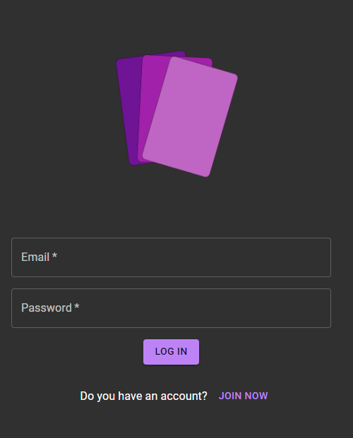
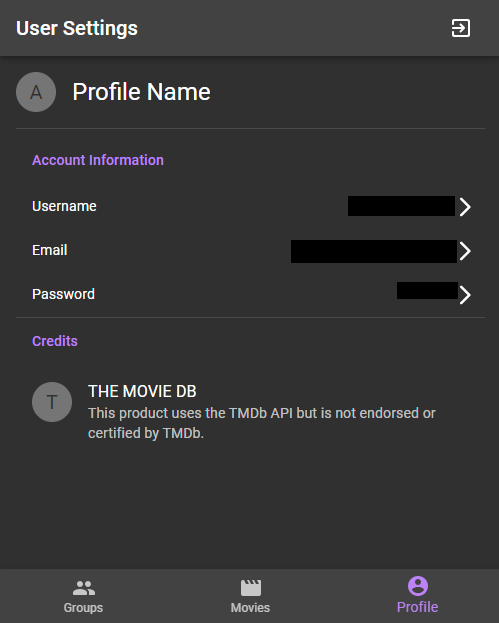
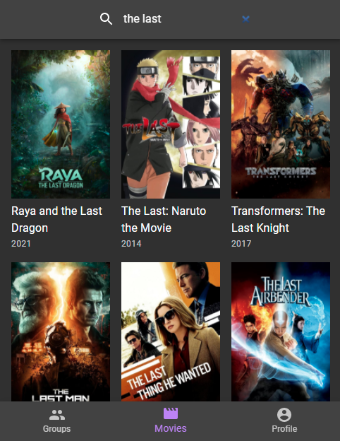
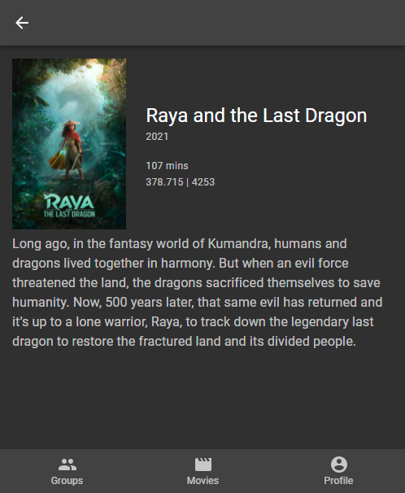
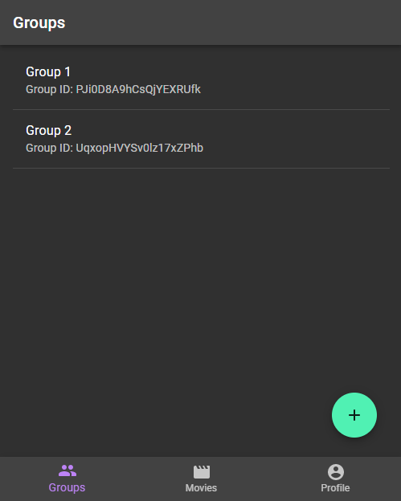
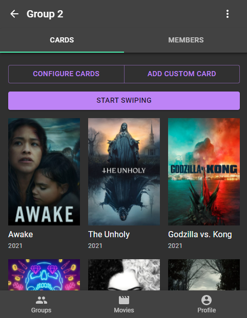
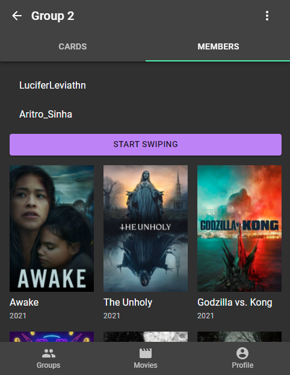
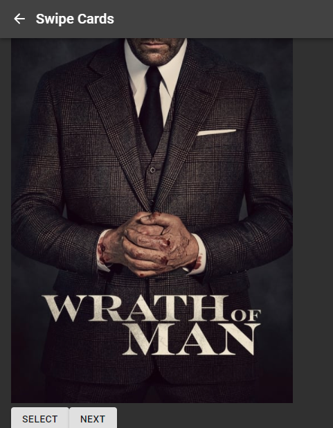
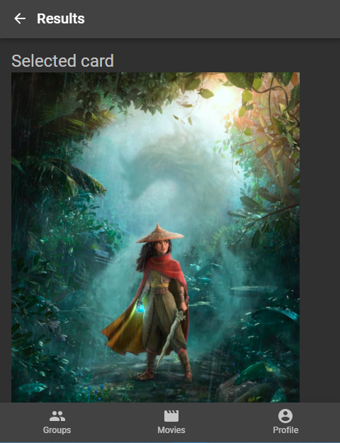

# MatchFlix made with Create React App
### NOTE: The my app wont work because the firebase database is currently off. You can fork and connect to a differnet database to make it work.
This project was bootstrapped with [Create React App](https://github.com/facebook/create-react-app).

## Running the project

In the project directory, :

- Run `npm install`:
This will install the dependencies

- Run `npm install netlify-cli -g`:
This will install nelify as a global dependency

- Add `.env` and `.env.local` variables

- Run `netlify dev`: 
Runs the app in the development mode.
Open [http://localhost:8888](http://localhost:8888) to view it in the browser.

## ScreenShots

